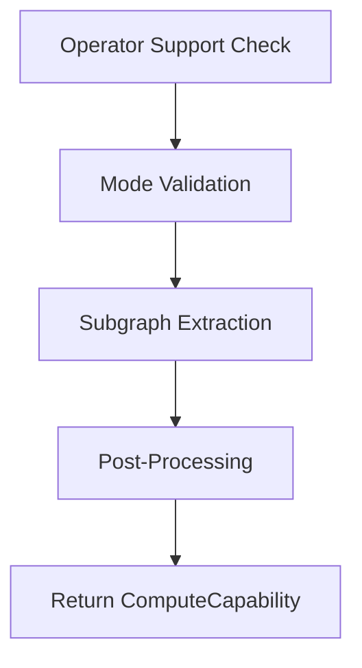

```mermaid
flowchart TD
    A[Operator Support Check]
    B[Mode Validation]
    C[Subgraph Extraction]
    D[Post-Processing]
    E[Return ComputeCapability]

    A --> B
    B --> C
    C --> D
    D --> E
```